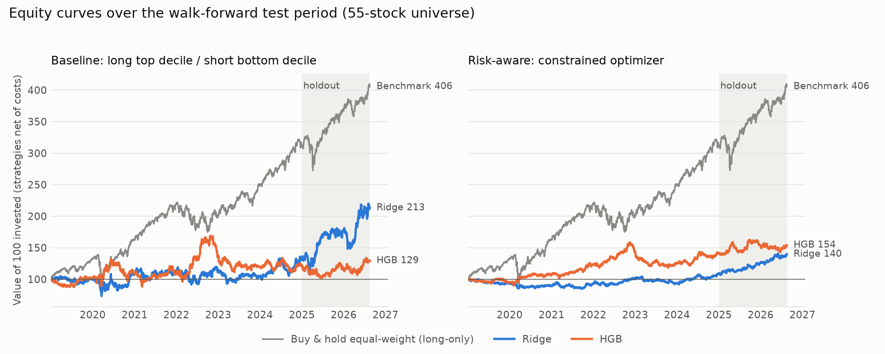

# ml-trading-system

A small, end-to-end machine learning trading system, built to answer one question honestly:

> Can a model that only knows what was public at the close of a trading day rank 55 large US stocks well enough to make money over the next week, *after* trading costs and sensible risk limits?

Short answer: **not demonstrated.** The models find a faint signal, but it's too weak and too unstable to tell apart from luck once real-world frictions are counted. That's a perfectly fine outcome for this project. It was built to be a careful, leak-free, testable pipeline, and to show its work when the result is a "no". It is not a money machine, and nothing here is investment advice.



## The idea in plain English

Instead of predicting where a stock's price will go (hard, and mostly a bet on the whole market), the system predicts **which stocks will beat their own sector over the next five trading days**. Then it goes long the ones it likes best and short the ones it likes least, so market swings largely cancel out.

Each piece of the pipeline exists to keep that experiment from fooling itself:

1. **Data.** Daily prices for 55 large US stocks from yfinance, checked for gaps, stale prices and suspicious jumps.
2. **Features.** Twenty simple signals per stock per day (momentum, volatility, trading volume, how it's doing versus its sector and the market). Each one is computed only from information available at that day's close, and there's an automated test that tries to catch any peeking at the future.
3. **Models.** A ladder from dumb to fancy: predict the average, a one-line "recent losers bounce back" rule, linear regression, ridge regression, gradient-boosted trees. Each has to beat the ones below it.
4. **Honest validation.** Walk-forward testing: train on the past, predict the next year, roll forward. Never shuffled, and with a gap so training labels can't overlap the test period.
5. **Portfolio.** Two versions: a simple "top 10% long, bottom 10% short", and an optimizer that respects limits on position size, sector bets, market exposure, volatility and turnover.
6. **Realistic backtest.** An event-driven simulator where a decision made after the close trades at the *next day's open*, and every trade pays commission, spread, slippage and short-borrow fees.

## What it found

- The best models rank stocks only slightly better than chance (rank IC around 0.01), and the edge comes and goes from year to year. Much of what the linear models learned looks like plain short-term reversal.
- The simple long/short book looked decent on the surface (Sharpe up to ~0.5), but mostly because it was quietly long the market. Strip that out and the alpha is about zero.
- Trading costs matter enormously. With no signal at all, the same machinery loses roughly 11% a year just from turnover.
- The optimizer-based portfolio trades far less, survives much higher costs, and is more stable, but its edge still isn't statistically significant.
- None of the strategies beat simply buying and holding the same 55 stocks over 2019–2026.
- Sanity checks came out clean: models trained on scrambled labels show no skill, which is what you'd want if the pipeline isn't leaking.

The full write-up, including what was tried, how many times, and how far to trust each number, is in [docs/results.md](docs/results.md).

## Try it

Needs Python 3.11+.

```bash
python -m venv .venv && source .venv/bin/activate
pip install -e '.[dev,viz]'

# data → features
python -m mltrading.data.ingest
python -m mltrading.data.validate
python -m mltrading.features.build

# train, backtest, stress-test everything (about 2.5 minutes)
python -m mltrading.experiments.run --config configs/v1.toml --note "why I'm running this"

# tables, charts, tests
python -m mltrading.experiments.report
python -m mltrading.experiments.plots
python -m pytest -q
```

Everything is driven by one config file, [configs/v1.toml](configs/v1.toml). Results land in `results/`, and every full run adds a line to [docs/attempt_log.jsonl](docs/attempt_log.jsonl) so the number of attempts is on the record.

There's also batch scoring (`python -m mltrading.models.infer --model ridge`) and a tiny HTTP endpoint (`python -m mltrading.models.serve`). Both refuse to use data older than a week unless you tell them otherwise.

## What's where

| Folder | What lives there |
|---|---|
| `src/mltrading/data`, `features` | ingestion, validation, the 20 features, the 5-day label |
| `src/mltrading/models` | model ladder, walk-forward validation, metrics, saved-model registry, inference |
| `src/mltrading/portfolio` | the two portfolio builders and the risk model |
| `src/mltrading/backtest` | the event-driven simulator, trading costs, performance metrics |
| `src/mltrading/experiments` | the one-command experiment, robustness checks, reports, benchmarks |
| `tests/` | 85 tests, mostly small hand-calculated examples; no network needed |
| `docs/` | the spec, architecture, results, benchmarks and limitations |

## Things to keep in mind

- **Survivorship bias.** The universe is today's liquid stocks, so the past looks better than it really was. Treat every number as an upper bound.
- **Small and short.** 55 stocks means only about six names per side, and the walk-forward test covers 2019–2026, mostly a bull market. The final 20 months are the "holdout", but it's short and was partly seen while smoke-testing (this is disclosed in the results doc).
- **Simplified trading.** Costs are flat basis-point estimates and fills happen at the open. Real markets are messier.
- **One deviation from the original plan.** Gradient boosting uses scikit-learn's implementation instead of XGBoost or LightGBM, because those need a system library that wasn't installed here.

## Read more

- [docs/results.md](docs/results.md): what happened and how much to trust it
- [docs/how_it_works.md](docs/how_it_works.md): a learning log explaining each concept, the math, and the tests behind it
- [docs/architecture.md](docs/architecture.md): how the pieces fit together
- [docs/benchmarks.md](docs/benchmarks.md): profiling and a measured speed-up (and a bug it helped uncover)
- [docs/limitations.md](docs/limitations.md): everything that limits the conclusions
- [docs/project_spec.md](docs/project_spec.md): the original specification
